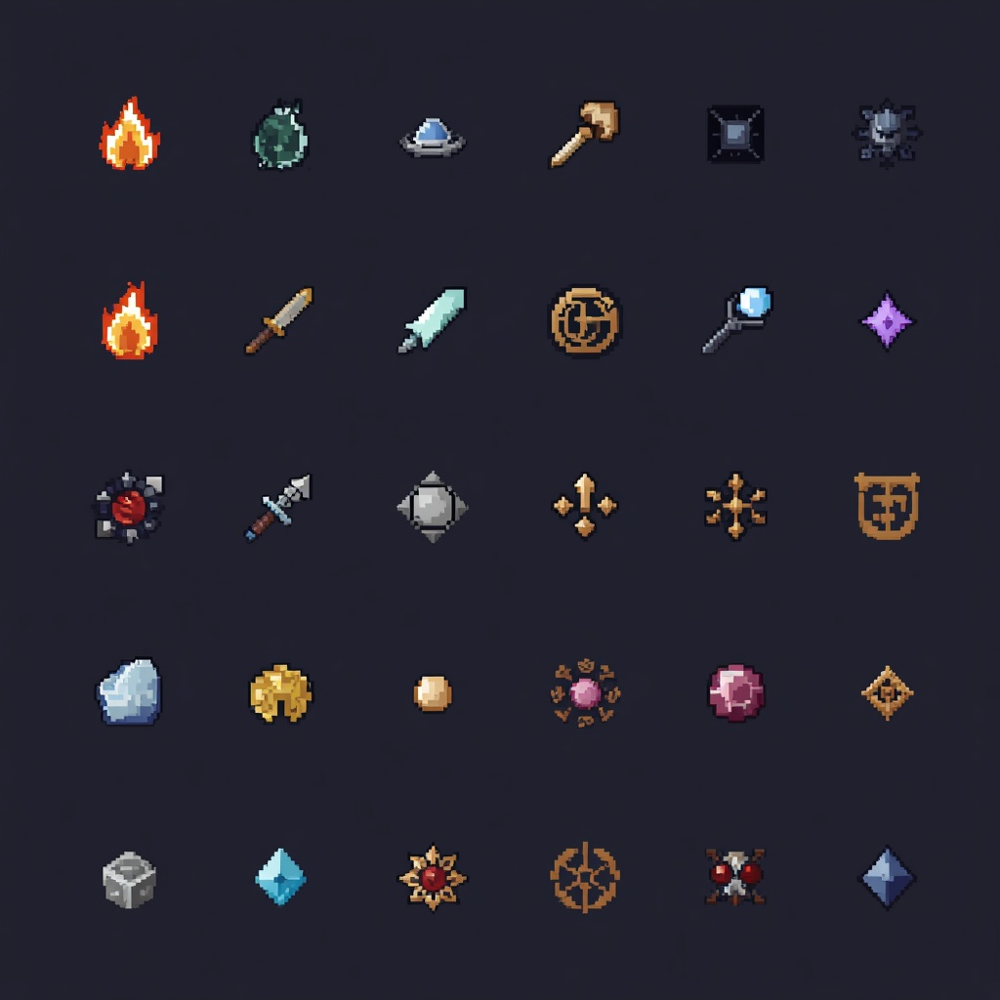
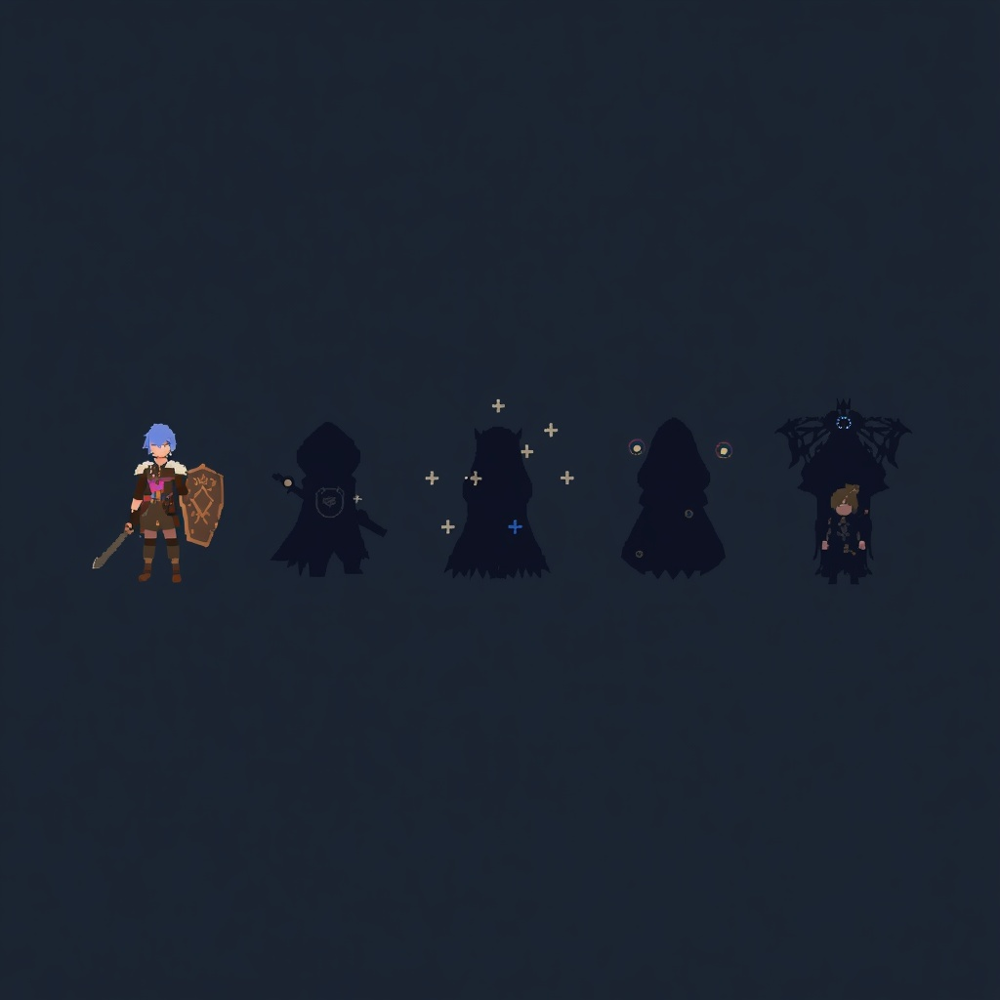
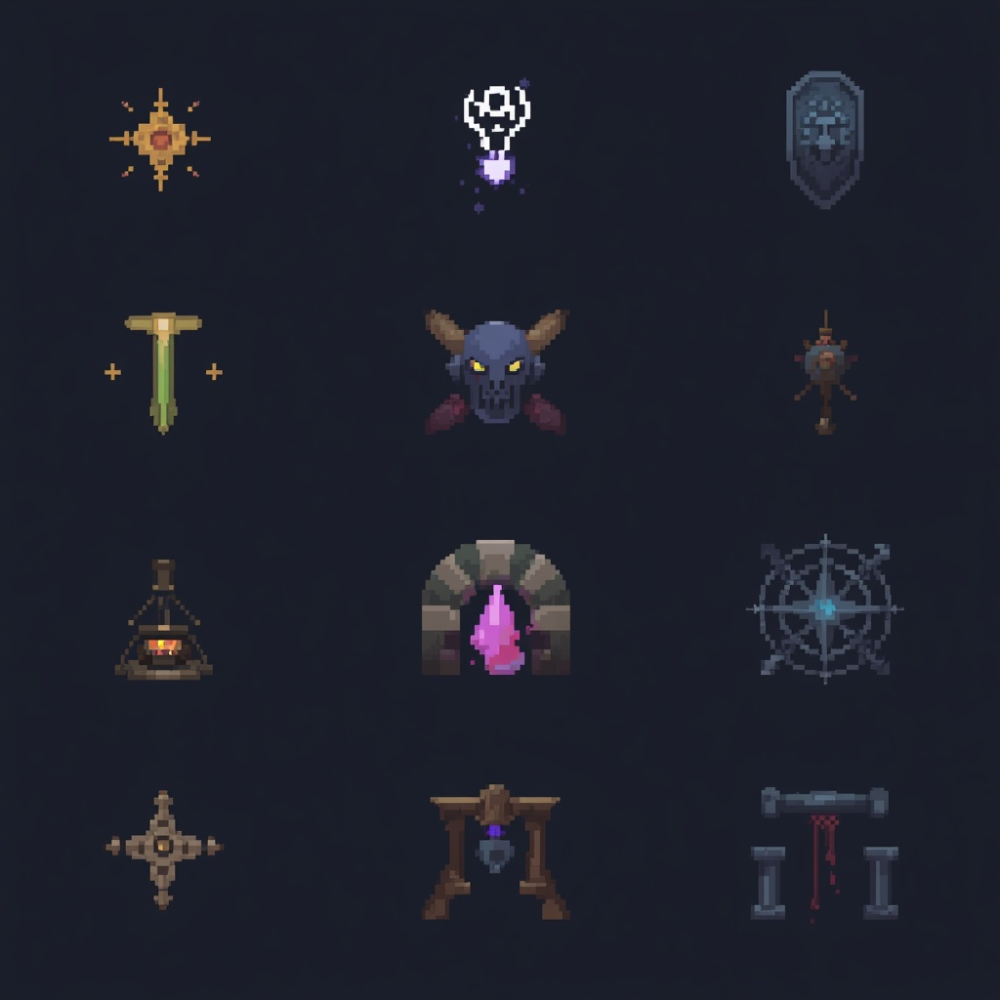
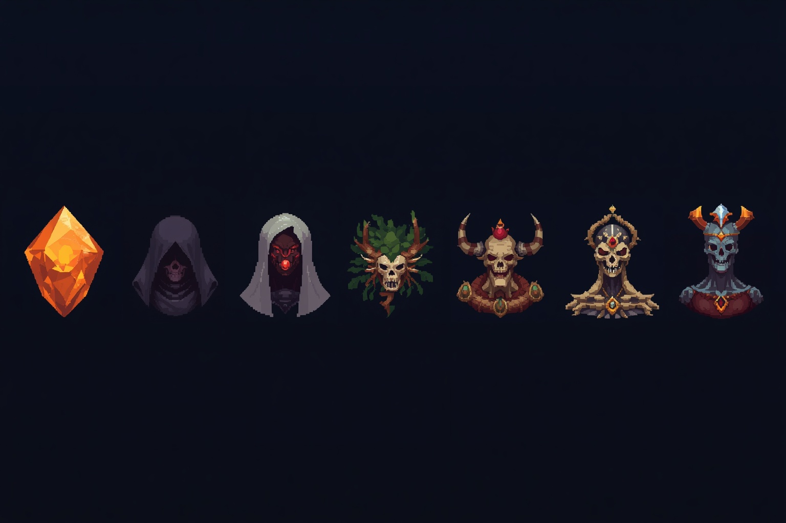
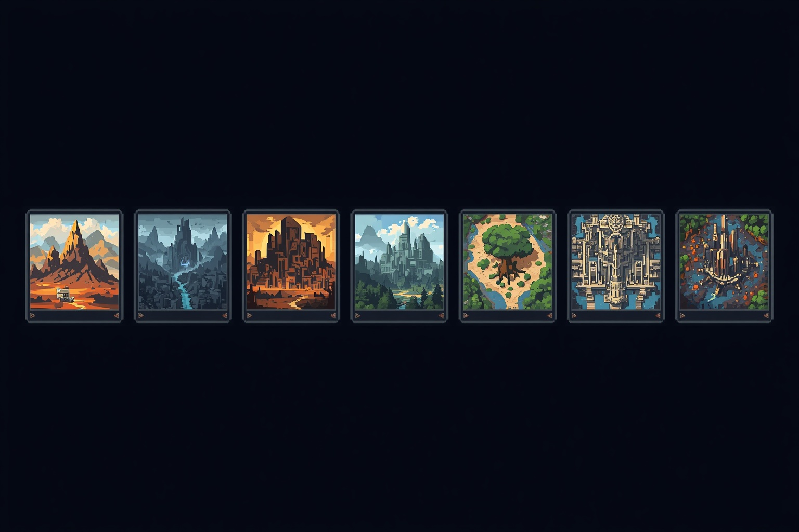

# Manifesto — Primeira Leva Econômica Pixel Art

Gerações feitas via MCP do Leonardo.ai em modo econômico. Nenhum arquivo do app foi alterado.

## Orçamento

- Ferramenta usada: `mcp__leonardo_ai.high_definition_generalist`.
- Saldo/token balance: o MCP exposto nesta sessão não forneceu endpoint de consulta de saldo; o terminal também não tinha `LEONARDO_API_KEY` visível para consultar `/me` diretamente.
- Controle adotado: poucas chamadas, sem variações, sem upscale e sem pós-processamento caro.
- Total de gerações: `14`.
- Custo total informado pelo Leonardo: `$0.1828 USD`.
- Observação: as 6 primeiras gerações foram mantidas como rascunhos porque ajudaram a validar direção, mas possuem pseudo-texto. As versões `07` a `14` são as melhores para avaliação visual.

## Arquivos Gerados

| # | Arquivo | Dimensão | Custo | Status | Uso |
|---:|---|---:|---:|---|---|
| 01 | `images/leonardo/01-style-direction-sheet.jpg` | 1024x1024 | `$0.012` | Rascunho com pseudo-texto | Direção geral |
| 02 | `images/leonardo/02-kael-hero-archetypes-sheet.jpg` | 1024x1024 | `$0.012` | Rascunho com pseudo-texto | Kael/heróis |
| 03 | `images/leonardo/03-ancient-fragments-bosses-sheet.jpg` | 1024x1024 | `$0.012` | Rascunho com pseudo-texto | Bosses |
| 04 | `images/leonardo/04-territory-biomes-sheet.jpg` | 1024x1024 | `$0.012` | Rascunho com pseudo-texto | Biomas |
| 05 | `images/leonardo/05-ui-icons-resources-sheet.jpg` | 1024x1024 | `$0.012` | Rascunho com pseudo-texto | Ícones |
| 06 | `images/leonardo/06-vfx-props-sheet.jpg` | 1024x1024 | `$0.012` | Rascunho com pseudo-texto | VFX/props |
| 07 | `images/leonardo/07-ui-icons-unlabeled-retry.jpg` | 1024x1024 | `$0.012` | Bom para avaliação | Ícones/UI/recursos |
| 08 | `images/leonardo/08-visual-direction-unlabeled-retry.jpg` | 1024x1024 | `$0.012` | Limpo, mas esparso | Direção geral |
| 09 | `images/leonardo/09-kael-hero-lineup-unlabeled-retry.jpg` | 1024x1024 | `$0.012` | Bom para avaliação | Kael/heróis |
| 10 | `images/leonardo/10-boss-lineup-unlabeled-retry.jpg` | 1024x1024 | `$0.012` | Parcial | Bosses |
| 11 | `images/leonardo/11-biome-thumbnails-unlabeled-retry.jpg` | 1024x1024 | `$0.012` | Parcial | Biomas |
| 12 | `images/leonardo/12-vfx-props-unlabeled-retry.jpg` | 1024x1024 | `$0.012` | Bom para avaliação | VFX/props |
| 13 | `images/leonardo/13-boss-lineup-wide-clean.jpg` | 1536x1024 | `$0.0194` | Melhor versão | 7 Fragmentos Antigos |
| 14 | `images/leonardo/14-biome-atlas-wide-clean.jpg` | 1536x1024 | `$0.0194` | Melhor versão | 7 biomas |

## Galeria Recomendada

### 07 — Ícones/UI/Recursos

### 09 — Kael e Arquétipos

### 12 — VFX e Props

### 13 — Fragmentos Antigos

### 14 — Biomas

## URLs Leonardo

| Arquivo | URL |
|---|---|
| 01 | https://cdn.leonardo.ai/users/d4eaa329-1eb9-4edb-8d38-68b4ec2d358d/generations/8854dc44-a243-4b2a-8c8d-0e2b62889a2c/segments/1:1:1/Lucid_Origin_a_surreal_and_vibrant_cinematic_photo_of_Pixel_ar_0.jpg |
| 02 | https://cdn.leonardo.ai/users/d4eaa329-1eb9-4edb-8d38-68b4ec2d358d/generations/7e91b1ae-1e94-43fb-b895-12cf80feefa8/segments/1:1:1/Lucid_Origin_a_surreal_and_vibrant_cinematic_photo_of_Pixel_ar_0.jpg |
| 03 | https://cdn.leonardo.ai/users/d4eaa329-1eb9-4edb-8d38-68b4ec2d358d/generations/aed3f657-ae5a-4436-83bd-0c0e0765b7d8/segments/1:1:1/Lucid_Origin_a_surreal_and_vibrant_cinematic_photo_of_Pixel_ar_0.jpg |
| 04 | https://cdn.leonardo.ai/users/d4eaa329-1eb9-4edb-8d38-68b4ec2d358d/generations/feca5511-2ab3-411f-9703-c1891afe21da/segments/1:1:1/Lucid_Origin_a_surreal_and_vibrant_cinematic_photo_of_Pixel_ar_0.jpg |
| 05 | https://cdn.leonardo.ai/users/d4eaa329-1eb9-4edb-8d38-68b4ec2d358d/generations/d6c75765-66b1-4911-892a-d7d19693c3fa/segments/1:1:1/Lucid_Origin_a_surreal_and_vibrant_cinematic_photo_of_Pixel_ar_0.jpg |
| 06 | https://cdn.leonardo.ai/users/d4eaa329-1eb9-4edb-8d38-68b4ec2d358d/generations/cedddf86-8f5d-482e-af24-43c03af638ea/segments/1:1:1/Lucid_Origin_Pixel_art_VFX_and_dungeon_prop_asset_sheet_for_Fr_0.jpg |
| 07 | https://cdn.leonardo.ai/users/d4eaa329-1eb9-4edb-8d38-68b4ec2d358d/generations/52631cd7-2fb8-4da4-842b-b5b90cacebd0/segments/1:1:1/Lucid_Origin_A_plain_unlabeled_pixel_art_sprite_atlas_for_a_da_0.jpg |
| 08 | https://cdn.leonardo.ai/users/d4eaa329-1eb9-4edb-8d38-68b4ec2d358d/generations/e2266eca-3fff-4eb3-a6e9-270f0f953acd/segments/1:1:1/Lucid_Origin_A_plain_unlabeled_pixel_art_visual_direction_mosa_0.jpg |
| 09 | https://cdn.leonardo.ai/users/d4eaa329-1eb9-4edb-8d38-68b4ec2d358d/generations/4f73c65a-7c86-43d6-986b-d7563c80eeb7/segments/1:1:1/Lucid_Origin_A_plain_unlabeled_pixel_art_character_lineup_for__0.jpg |
| 10 | https://cdn.leonardo.ai/users/d4eaa329-1eb9-4edb-8d38-68b4ec2d358d/generations/61e210dc-186b-4875-8664-2ac5305abaec/segments/1:1:1/Lucid_Origin_A_plain_unlabeled_pixel_art_boss_lineup_for_a_dar_0.jpg |
| 11 | https://cdn.leonardo.ai/users/d4eaa329-1eb9-4edb-8d38-68b4ec2d358d/generations/1011a5b9-cfda-41a6-b03a-361647767a34/segments/1:1:1/Lucid_Origin_A_plain_unlabeled_pixel_art_biome_thumbnail_atlas_0.jpg |
| 12 | https://cdn.leonardo.ai/users/d4eaa329-1eb9-4edb-8d38-68b4ec2d358d/generations/565d69f5-c0bd-4a56-896d-df85ce869297/segments/1:1:1/Lucid_Origin_A_plain_unlabeled_pixel_art_VFX_and_dungeon_prop__0.jpg |
| 13 | https://cdn.leonardo.ai/users/d4eaa329-1eb9-4edb-8d38-68b4ec2d358d/generations/0cd45699-27f2-4112-a18a-8aacd592dc09/segments/1:1:1/Lucid_Origin_Wide_plain_unlabeled_pixel_art_boss_lineup_for_a__0.jpg |
| 14 | https://cdn.leonardo.ai/users/d4eaa329-1eb9-4edb-8d38-68b4ec2d358d/generations/008696f5-057a-4aaf-a948-75371005c1e6/segments/1:1:1/Lucid_Origin_Wide_plain_unlabeled_pixel_art_biome_atlas_for_a__0.jpg |

## Limitações Observadas

- O Leonardo gerou pseudo-texto nas primeiras sheets, mesmo com instrução negativa. A formulação “plain unlabeled sprite atlas” reduziu bastante o problema.
- As imagens são JPG porque o CDN retornou JPG. Para produção real, gerar/recortar PNG com transparência.
- As sheets não são sprites finais prontos para o app; são guia visual e material de aprovação.
- A pixel art é uma interpretação do modelo, não pixel art manual com controle perfeito de grid.
- Para assets finais, recomenda-se recorte, limpeza de alpha, paleta travada e validação em 48dp/64dp.
